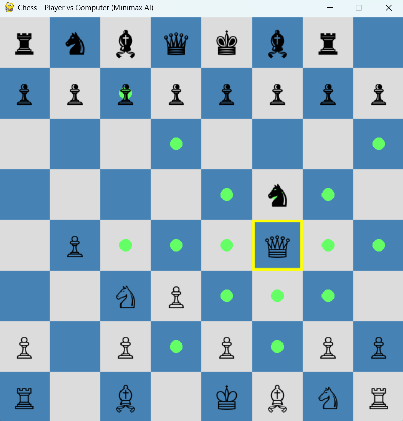

**Chess - Player vs. Computer (Minimax AI)**  

This document describes the setup, execution, and gameplay for the AI Chess application found in chess_minimax.py.  
________________________________________

**How to Run the File**  
1.	Save the code: Ensure the provided Python code is saved as chess_minimax.py within the appropriate directory (e.g., AI_Games/).  
2.	Open Terminal/Command Prompt: Navigate to the directory containing chess_minimax.py.  
3.	Execute: Run the script using your Python interpreter:  

<b>python chess_minimax.py</b>

________________________________________

**Required Software/Library/Framework**  

The game requires Python 3.x and two essential third-party libraries. You must install them using pip before running the file:  
1.	**Pygame**: Used for the graphical interface (window, board, piece drawing, and mouse input).  
pip install pygame  
2.	**python-chess**: A powerful library used for all chess rules, move validation, board state management, and standard chess logic.  

<b>pip install python-chess</b>

________________________________________  

**How to Play the Game**  

This is a two-player game where the human is White and the AI is Black.  
1.	**Start**: The game begins with the standard chess opening position, with White having the first move.  
2.	**Making a Move (White - Human)**:  
a.	Select a piece: Click on the White piece you wish to move. The square will be highlighted yellow.  
b.	View legal moves: Small green circles will appear on all legal destination squares for the selected piece.  
c.	Complete the move: Click on one of the green circles to move the piece.  
3.	**AI Response (Black - Computer)**:  
a.	After your move, the game will pause briefly. The Computer AI will then calculate and automatically execute its best move for Black.  
4.	**Game End**: The game ends when a Checkmate occurs (a win/loss) or a Draw condition is met (e.g., Stalemate, Insufficient Material, 50-move rule, etc.). The final result will be displayed on the screen.

________________________________________  

**Screenshot of the Game**  

________________________________________
**Algorithm Used for AI**  

The artificial intelligence for the Black pieces employs a classic search method:  
1.	**Minimax Algorithm**: This is the core algorithm used to determine the optimal move. It searches the game tree to find the move that maximizes the AI's (minimizing player's) score, assuming the human opponent (maximizing player) plays perfectly to maximize their own score.  
2.	**Alpha-Beta Pruning**: This is a crucial optimization applied to the Minimax search. It dramatically cuts down the number of board states the algorithm needs to evaluate by eliminating branches that are guaranteed not to lead to the best result, significantly improving performance.  
3.	**Heuristic**: The evaluation function primarily uses a simple material count (Queen=9, Rook=5, etc.) to assign a numerical score to any given board state. The AI searches to a fixed depth (default 2 moves) using this heuristic.

