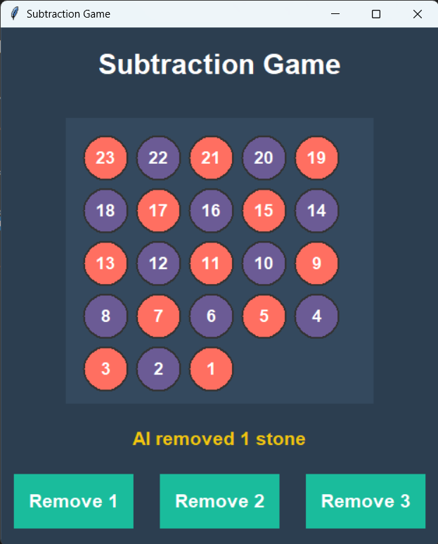

**Subtraction Game (Minimax AI)**  

This is a classic impartial game, often referred to as Nim (or a simple variant of Nim played with a single pile), where two players take turns removing a specific number of objects from a single pile. The AI uses the Minimax Algorithm to play optimally and guarantee a win from any non-losing position.  
__________________________________  
**How to Run the File**  

1.	**Save the Code**: Save the Python code (e.g., subtraction_game.py) to your local machine.  
2.	**Execute**: Open your terminal or command prompt, navigate to the directory where you saved the file, and run the following command:  

<b>python subtraction_game.py</b>
  

__________________________________  

**Required Software/Library/Framework**  
1.	**Python**: You must have Python 3 installed on your system.  
2.	**Tkinter**: This is Python's standard GUI library and is usually included with a standard Python installation. No separate installation should be required.

__________________________________

**How to Play the Game**  

1.	**Objective**: The game starts with 25 stones. The objective is to be the player who takes the last stone.  
2.	**Turns**: You (the Human Player) always go first.  
3.	**Moves**: On your turn, you must choose to remove exactly 1, 2, or 3 stones from the pile.  
4.	**Winning**: The player who makes the final move, leaving zero stones, wins the game.  
5.	**Gameplay**: Click one of the three buttons (Remove 1, Remove 2, Remove 3) to make your move. The AI will respond shortly after.

__________________________________

**Screenshot of the Game**  

__________________________________

**Algorithm Used**  

The AI for this game employs the Minimax Algorithm.  

**Minimax Principle**  
1.	**Goal**: Minimax is a decision-making algorithm for two-player, zero-sum games (like this Subtraction Game) where both players have perfect information. The algorithm's goal is to find the optimal move for the AI, assuming the opponent (the Human) also plays optimally.  
2.	**Maximizing/Minimizing**:  
a.	The AI is the Maximizing Player, attempting to choose moves that lead to the highest possible score (a win, valued at +1).  
b.	The Human is the Minimizing Player, attempting to choose moves that lead to the lowest possible score (an AI loss, valued at -1).  
3.	**Recursive Search**: The algorithm explores the entire game tree (all possible future moves) until it reaches a terminal state (0 stones). It then backs up the utility scores (+1 or -1) to the current position to determine the best available move.  
The initial starting position of 25 stones is a losing position for the starting player if the opponent plays perfectly. The AI is designed to exploit this, and by following the Minimax strategy, it will always win unless the player makes an optimal first move to force the AI into a losing position.

